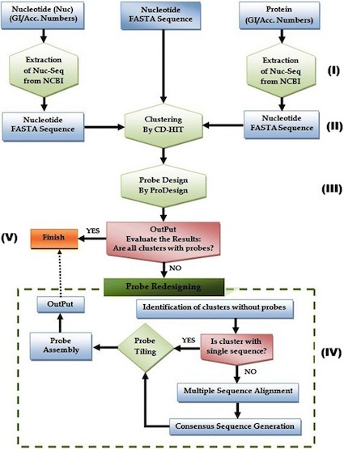

# Welcome to the Ahren Lab!

## My main research topics
I have many interests when it comes to science! Here I have selected a few of the recent projects and divided them into themes, although this is fairly arbitrary division.

[Full list of publications according to Google Scholar:](https://scholar.google.com/citations?hl=sv&user=lqZKmqIAAAAJ&view_op=list_works&sortby=pubdate)

* [Effects of microbial communities and metabolic functions due to a changing climate](#ArcticMetagenome)
* [Pathogen/symbiont-host interactions using integrative omics, mainly Genomics and transcriptomics](#Pathogen)
* [Bioinformatics tool development](#Bioinfo)
* [Single cell genomics of complex eukaryotes](#singlecellGenomics)

* * * *

# <a name="Bioinfo">Bioinformatic tools</a>
Team: Dag Ahrén, Lokeshwaran Manoharan, Sandeep Kushwaha

#### MetCap pipeline for designing sequence probes for targeted metagenomics applications

Publication, BMC Bioinformatics: [MetCap: A bioinformatics probe design pipeline for large-scale targeted metagenomics](http://dx.doi.org/10.1186/s12859-015-0501-8)

#### Interactive analysis of metagenomics data using Rshiny
Team: Arthur Boffelli, Joel White, Dag Ahrén

[Interomics on Github](https://github.com/Bioinformatics-master-Lund-University/interomics)
[Link to the Interomics Rshiny app](https://aboffelli.shinyapps.io/interomics/)

#### R pipeline for analysing Arbuscular Mycorrhiza Pacific Biosciences sequence data

[PacBio_AMF_workflow on Github](https://github.com/dagahren/PacBio_AMF_workflow)

### Support vector machine Predictor for plant resistance proteins

Publication, Bioinformatics 2015: [NBSPred: a support vector machine-based high-throughput pipeline for plant resistance protein NBSLRR prediction](https://academic.oup.com/bioinformatics/article/32/8/1223/1744116?login=true)
* * * *

# <a name="ArcticMetagenome">Effects of microbial communities and metabolic functions due to a changing climate</a> 

Team: Dag Ahrén, Lena Ström, Joel White

### Functional potential of microbial metabolism controlling the biogeochemical carbon cycle in northern peatlands
Despite the importance of northern wetlands as one of the worlds largest CO2 sinks, remarkably little is known about the biogeochemical processes and the microbial genes that drive these processes. The carbon is accumulating due to the anoxic, wet conditions in combination with low microbial activity due to cold temperatures, leading to a net deposition of carbon from the primary production in the form of peat. On the other hand, the conditions in these waterlogged soils favour methane production, which is a very potent GHG. The project is run in collaboration with Lena Ström and funded by Formas.
  
  In this project we will combine various environmental measurements such as gas flux measurements, vegetation and soil properties including pH, organic carbon availability and microbial activity with the functional diversity of genes involved in the pathways directly or indirectly linked to the methane cycling. Samples from temperate and arctic sites in Scandinavia (Skogaryd and Abisko, Sweden) as well as artic samples from Zackenberg, Greenland will be analysed to *study the effect on the environmental factors and how the functional diversity of the methane cycle is altered in response to these factors*.
  
We are using a technique called capture metagenomics that was sucessfully developed in my group. We used the bioinformatics pipeline called MetCap (Figure 1) to design suitable probes based on all publicly available sequences in KEGG that are related to methane pathways [@kanehisa2000kegg]. By designing about 300,000 probes that specifically target the different genes involved in the methanogenesis and methane oxidation enrichment of sequences related to the methane cycling can be performed. The enrichment makes it feasible to investigate large number of samples without having to resort to brute force sequencing of entire metagenomes. The first samples have been sent for sequencing and is expected to be delivered early spring 2019. The approach requires novel, advanced bioinformatic techniques both before and after sequencing, but in return allows for near exhaustive identification of the diversity of the targeted genes. 

* * * *

# <a name="SoilMetagenome">Metagenomics & amplicon sequencing for improved agricultural management</a> 

### Understanding how microorganisms in soils drive biogeochemical processes (Funded by Formas).

Although many biochemical reactions have been described decades ago, there are many cases where the genes encoding for enzymes that catalyze these reactions have not been identified. The discovery is often hampered by the fact that many bacteria can not be cultured. Therefore, culture-free methods for studying the microbial communities and their biochemical compounds is needed. Recent developments in high throughput sequencing has made it feasible to sequence complex metagenomes and has identified novel organism groups as well as previously uncharacterized diversity of genes. These discoveries are particularly important in the light of the changing climate that the world is facing, since the genes can both act as markers for how environmental changes are affecting the communities but also may provide the solution for reducing green house gas (GHG) emmissions and thereby reduce the anthropogenic impact on the planet. 
*My current research focus on carbon cycling in soils to understand the effects of climate change on microbial communities and to provide insights into the molecular basis for a sustainable agriculture*.

### Arbuscular mycorrhiza
Team: Dag Ahrén, Katja Kozjek, Katarina Hedlund, Pål Axel Olsson

Publication: [Long-term agricultural management impacts arbuscular mycorrhizal fungi more than short-term experimental drought](https://www.sciencedirect.com/science/article/pii/S0929139321002638)

* * * *

# <a name="Pathogen">Pathogen/symbiont-host interactions using integrative omics, mainly Genomics and transcriptomics</a> 

### Avian Malaria

Team: Victor Kalbskopf, Dag Ahrén, Olof Hellgren, Shifts in gene expression variability in the blood-stage of *Plasmodium relictum*

Publication Gene 2021: [Shifts in gene expression variability in the blood-stage of Plasmodium relictum](https://www.sciencedirect.com/science/article/pii/S0378111921003176)

### Songbird adaptation to an urban environment
Publication, Nature 2021: [Continent-wide genomic signatures of adaptation to urbanisation in a songbird across Europe](https://www.nature.com/articles/s41467-021-23027-w)

* * * *

# <a name="singlecellGenomics">Single Cell Genomics of Complex Eukaryotes</a>
Team: Raphael Gollnisch, Dag Ahrén, Karin Rengefors

### Methods development of SAG-RAD sequencing

### Single cell & population genomics of Gonyostomum semen

[Calcium and pH interaction limits bloom formation and expansion of a nuisance microalga](https://aslopubs.onlinelibrary.wiley.com/doi/10.1002/lno.11896)

### Population genomics and transcriptomics in Dinoflagellates

### Fungal genomics and transcriptomics
Publication ISME 2020: [Uncovering the hidden diversity of litter-decomposition mechanisms in mushroom-forming fungi](https://www.nature.com/articles/s41396-020-0667-6)

